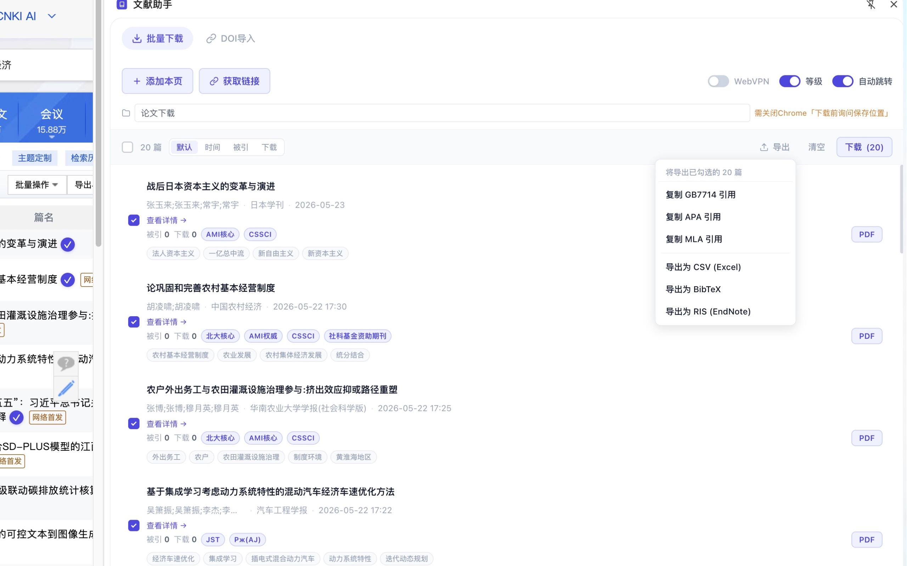

# 文献助手

知网文献 PDF 批量下载 Chrome 扩展。

## 功能

- 在知网搜索结果页、期刊目录页一键收藏文献
- 批量获取 PDF 下载链接
- 批量下载 PDF，支持指定保存子文件夹
- DOI 导入：粘贴 DOI 列表，自动通过 Unpaywall 获取英文文献 PDF
- 支持学校 WebVPN / 机构代理（edu.cn 域名）
- 导出文献信息为 CSV、BibTeX、RIS 格式
- 支持 GB7714、APA、MLA 引用格式

## 安装

从 [Chrome Web Store](https://chromewebstore.google.com/detail/%E6%96%87%E7%8C%AE%E5%8A%A9%E6%89%8B/lkmbpjkmfijfehbebfkhalhdlopneinh) 安装，或下载 [Release](https://github.com/zoglmk/cnki-helper/releases) 中的 zip 文件手动加载。

**手动加载步骤：**
1. 下载并解压 zip
2. 打开 Chrome，进入 `chrome://extensions/`
3. 开启右上角「开发者模式」
4. 点击「加载已解压的扩展程序」，选择解压后的文件夹

## 使用说明

1. 打开知网搜索结果页或期刊目录页
2. 点击插件图标打开侧边栏
3. 点击「添加本页」收藏文献
4. 点击「获取链接」解析 PDF 地址
5. 勾选文献，点击「下载」批量下载

> 建议每次下载不超过 20 篇，下载后间隔一段时间再继续，避免触发知网访问限制。

## 关于作者

欢迎关注公众号，获取插件更新通知及其他 AI 效率工具分享。

公众号：**zgmgm**

## 隐私政策

见 [PRIVACY.md](./PRIVACY.md)

## 项目起源

本项目由油猴脚本演化而来。早期版本以 Greasyfork 用户脚本形式发布，后重构为浏览器扩展以支持更完整的功能。

原始脚本：[中国知网CNKI硕博论文PDF下载 - Greasy Fork](https://greasyfork.org/zh-CN/scripts/389343-%E4%B8%AD%E5%9B%BD%E7%9F%A5%E7%BD%91cnki%E7%A1%95%E5%8D%9A%E8%AE%BA%E6%96%87pdf%E4%B8%8B%E8%BD%BD)

## 版本历史

- **v1.2.1** — 修复 DOI 下载失败触发批量暂停的问题，优化权限范围
- **v1.2.0** — 新增 DOI 导入英文文献、指定下载文件夹、批量重试，修复批量下载稳定性及学校 WebVPN 兼容问题
- **v1.1.0** — 新增期刊目录页支持、批量重试按钮
- **v1.0.2** — 下载稳定性优化
- **v1.0.0** — 初始版本
