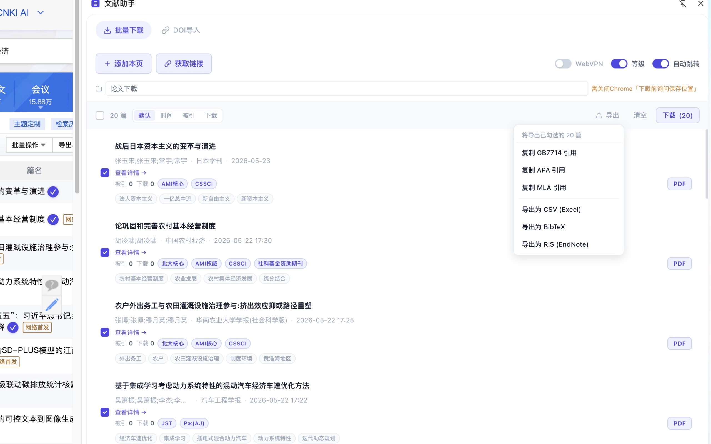

# 文献助手

知网文献与 ProQuest 公开学位论文 PDF 批量下载 Chrome 扩展。

## 功能

- 在知网搜索结果页、期刊目录页一键收藏文献
- 在 ProQuest 搜索结果页和详情页收藏公开学位论文，支持跨页勾选和批量下载
- 批量获取 PDF 下载链接
- 批量下载 PDF，支持指定保存子文件夹
- DOI 导入：粘贴 DOI 列表，自动通过 Unpaywall 获取英文文献 PDF
- 支持学校 WebVPN / 机构代理（edu.cn 域名）
- 支持自行添加图书馆 / 代理域名，按站点授权，无需等待插件更新
- 导出文献信息为 CSV、BibTeX、RIS 格式
- 支持 GB7714、APA、MLA 引用格式

## 安装

从 [Chrome Web Store](https://chromewebstore.google.com/detail/%E6%96%87%E7%8C%AE%E5%8A%A9%E6%89%8B/lkmbpjkmfijfehbebfkhalhdlopneinh) 安装，或下载 [Release](https://github.com/zoglmk/cnki-helper/releases) 中的 zip 文件手动加载。

**手动加载步骤：**
1. 下载并解压 zip
2. 打开 Chrome，进入 `chrome://extensions/`
3. 开启右上角「开发者模式」
4. 点击「加载已解压的扩展程序」，选择解压后的文件夹

## 使用说明

1. 打开知网搜索结果页或期刊目录页
2. 点击插件图标打开侧边栏
3. 点击「添加本页」收藏文献
4. 点击「获取链接」解析 PDF 地址
5. 勾选文献，点击「下载」批量下载

> 建议每次下载不超过 20 篇，下载后间隔一段时间再继续，避免触发知网访问限制。

### ProQuest 公开全文

1. 在 ProQuest 搜索结果页点击论文旁的「收藏全文」，或在插件中点击「添加本页」。只收录页面明确标为公开的学位论文，预览、需订购和未确认开放获取的条目跳过。
2. 翻到下一页继续收藏或添加本页。此前收藏和取消勾选的状态保留，同一论文按 ProQuest 文档 ID 去重。当前不自动翻页抓取整个检索结果。
3. 点击「获取链接」，勾选所需文献后统一下载。公开论文详情页也支持直接收藏，兼容简化公开页和带阅读器工具栏的详情页。
4. 下载前重新读取公开详情和 PDF 链接，检查 PDF 文件头，再按标题保存到指定子文件夹。使用现有下载完成判断；队列逐篇处理，间隔 1–2 秒，完成等待仍为 120 秒，超时提示检查 Chrome 下载列表。

本版不需要 ProQuest 账号；机构订阅、已购买全文和预览文件下载留待后续版本。WebVPN 开关仅影响原有知网流程，不会改写 ProQuest 的媒体地址。新增内置访问范围仅为 `www.proquest.com`、`proquest.com` 和 `media.proquest.com`；不需要把它们加入图书馆代理设置。

清单保存论文 ID、无会话参数的详情地址和元数据，不长期保存 ProQuest 的媒体签名。导出支持 CSV、RIS 和 BibTeX；公开页未提供学位种类时，BibTeX 使用 `misc` + `type=Thesis`，不猜测硕士或博士。

### 图书馆 / 代理域名

若从图书馆进入知网后没有收藏按钮，可在侧边栏展开「图书馆 / 代理域名」，粘贴**进入知网后的地址栏网址**，点击「授权并添加」，并在 Chrome 提示中允许访问。

- 可填写域名或完整 HTTP / HTTPS 网址；只保存域名，不保存路径、查询参数或登录信息。
- 授权范围包含填写的域名及其子域名，同时支持 HTTP / HTTPS，不限端口。例如填写 `library.hb.cn` 或 `*.library.hb.cn`，即可匹配 `ycfw.library.hb.cn` 等子域名。不会自动扩大到父域名。
- 保存后自动加载页面脚本并跨浏览器重启保留；若当前页面仍没有按钮，刷新后点击「添加本页」。
- 点击「移除」会撤销该域名权限，已打开的页面刷新后生效；内置知网、学校代理及 DOI 权限不受影响。
- 域名设置解决的是访问权限和页面脚本匹配问题。代理若修改了知网页面结构、嵌套在其他域名的 iframe 中，或改变了下载接口，仍可能需要单独适配。原有 WebVPN 开关和链接转换方式保持不变，不会因添加域名自动开启。

湖北省图书馆[官网](https://www.library.hb.cn/)目前提供的远程入口为 `https://ycfw.library.hb.cn:8000/`。填写 `library.hb.cn` 可覆盖这个入口及同一根域名下的其他代理子域名和端口；只需当前入口时也可填写 `ycfw.library.hb.cn`。若进入知网后换到了其他根域名，再添加实际域名。

### 本地验证

运行 `node --test tests/*.test.cjs` 检查域名权限、下载状态、目录归属、并发清单、勾选导出及 DOI 重试。浏览器集成脚本和实际验证边界见 [回归验证](tests/README.md)；本地模拟响应不等于已验证真实知网账号下载。

## 关于作者

欢迎关注公众号，获取插件更新通知及其他 AI 效率工具分享。

公众号：**zgmgm**

## 隐私政策

见 [PRIVACY.md](./PRIVACY.md)

## 项目起源

本项目由油猴脚本演化而来。早期版本以 Greasyfork 用户脚本形式发布，后重构为浏览器扩展以支持更完整的功能。

原始脚本：[中国知网CNKI硕博论文PDF下载 - Greasy Fork](https://greasyfork.org/zh-CN/scripts/389343-%E4%B8%AD%E5%9B%BD%E7%9F%A5%E7%BD%91cnki%E7%A1%95%E5%8D%9A%E8%AE%BA%E6%96%87pdf%E4%B8%8B%E8%BD%BD)

## 版本历史

- **v1.3.0（待发布）** — 新增与知网并列的 ProQuest 公开学位论文支持，兼容两种详情布局；跨页收藏、去重与勾选，下载时刷新媒体链接，跳过预览及非公开条目
- **v1.2.3** — 新增自定义图书馆 / 代理域名设置，按域名申请可选权限；修复非教育网代理页识别与延迟加载激活问题；修复下载归属/完成判断、并发清单保存、选择与导出、链接解析和 DOI 重试
- **v1.2.2** — 修复 DOI 导入因权限缺失导致全部失败的问题
- **v1.2.1** — 修复 DOI 下载失败触发批量暂停的问题，优化权限范围
- **v1.2.0** — 新增 DOI 导入英文文献、指定下载文件夹、批量重试，修复批量下载稳定性及学校 WebVPN 兼容问题
- **v1.1.0** — 新增期刊目录页支持、批量重试按钮
- **v1.0.2** — 下载稳定性优化
- **v1.0.0** — 初始版本

### 稳定性修复说明（待发布）

- 下载任务按原始地址和下载 ID 识别；启动等待 15 秒，完成等待 120 秒。超过完成等待时间会提示检查 Chrome 下载列表，不会显示成功。已有文件传输由 Chrome 继续处理。
- 清空列表会停止尚未启动的队列和旧结果回写；已交给 Chrome 的文件下载继续由浏览器管理。
- 勾选状态在排序和刷新后保留；无 PDF 的文献可单独导出。全部取消勾选时不再默认导出整个清单。
- 获取链接失败可点击重试解析；DOI 查询失败后可再次提交相同 DOI，更新原条目，不重复添加。
- DOI 无开放获取链接时会查询 sci.bban.top，提交的信息见 [隐私说明](PRIVACY.md)。
- DOI 文件名和子目录按下载 ID 保留，避免被服务器文件名覆盖；导出继续显示“另存为”对话框，不继承 PDF 子目录。
